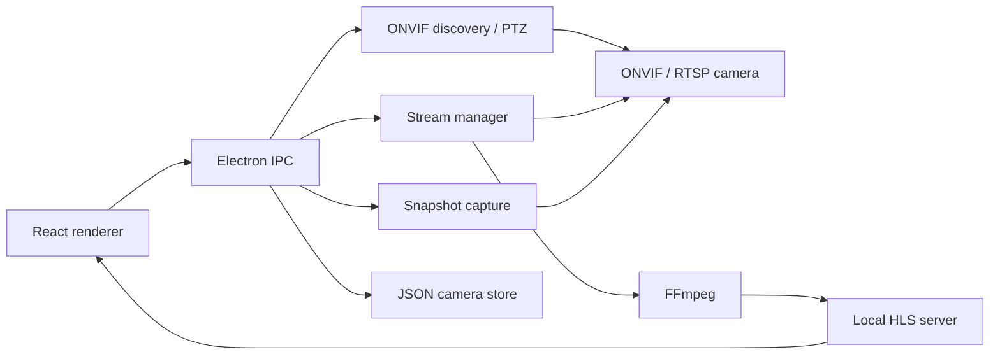

# CamFoundry

A small desktop app for viewing local network cameras.

CamFoundry discovers ONVIF cameras on your network, resolves their RTSP streams,
and plays them in a grid or focused single-camera view. You can also add cameras
by hand with an RTSP URL.

This is early software. The focus right now is local discovery, reliable
viewing, snapshots, and basic PTZ.

## What Works

- Discover ONVIF cameras on the local network.
- Add cameras manually by ONVIF host or RTSP URL.
- View live streams through a local HLS pipeline.
- Switch between the all-camera grid and a focused view.
- Start, pause, restart, and remove cameras.
- Toggle HD/SD for ONVIF cameras that expose multiple profiles.
- Capture snapshots.
- Pan, tilt, and zoom on cameras that support PTZ.

## Tech Stack

Electron · React · TypeScript · ONVIF · FFmpeg · HLS.js

## Running Locally

```sh
npm install      # install dependencies
npm run dev      # start in development
npm run typecheck
npm run build
```

The Makefile wraps the same commands: `make install`, `make dev`,
`make typecheck`, `make build`, and `make start` (build then preview).

## Packaging

Build installable artifacts with electron-builder:

```sh
npm run pack        # unpacked app for the current OS (quick smoke test)
npm run dist        # installer for the current OS
npm run dist:mac    # .dmg
npm run dist:win    # .exe (NSIS)
npm run dist:linux  # AppImage + .deb
```

Output lands in `dist/`. Cross-building Windows and Linux from macOS works for
most targets but is most reliable on each native OS (or CI).

Builds are **unsigned** by default, so macOS Gatekeeper and Windows SmartScreen
will warn ("unverified developer"). On macOS, right-click the app and choose
**Open** the first time. To produce signed builds, set the usual electron-builder
environment variables before running `npm run dist`:

- macOS signing: `CSC_LINK`, `CSC_KEY_PASSWORD`
- macOS notarization: `APPLE_ID`, `APPLE_APP_SPECIFIC_PASSWORD`, `APPLE_TEAM_ID`
- Windows signing: `CSC_LINK`, `CSC_KEY_PASSWORD`

App icons live in `resources/` (`icon.png`/`icns`/`ico`, generated from
`icon-source.png`).

## How It Works

For ONVIF cameras, CamFoundry asks the device for an RTSP stream URI. For manual
cameras, it uses the RTSP URL you give it.

FFmpeg reads the RTSP stream and writes a short local HLS playlist. The renderer
plays it with HLS.js through a local HTTP server bound to `127.0.0.1`.



## Project Shape

```text
src/main       Electron main process, IPC, ONVIF, streams, storage
src/preload    Safe bridge exposed to the renderer
src/renderer   React UI
src/shared     Types shared across processes
```

## Support

If you find CamFoundry useful, you can
[buy me a coffee](https://buymeacoffee.com/appinheiro).
