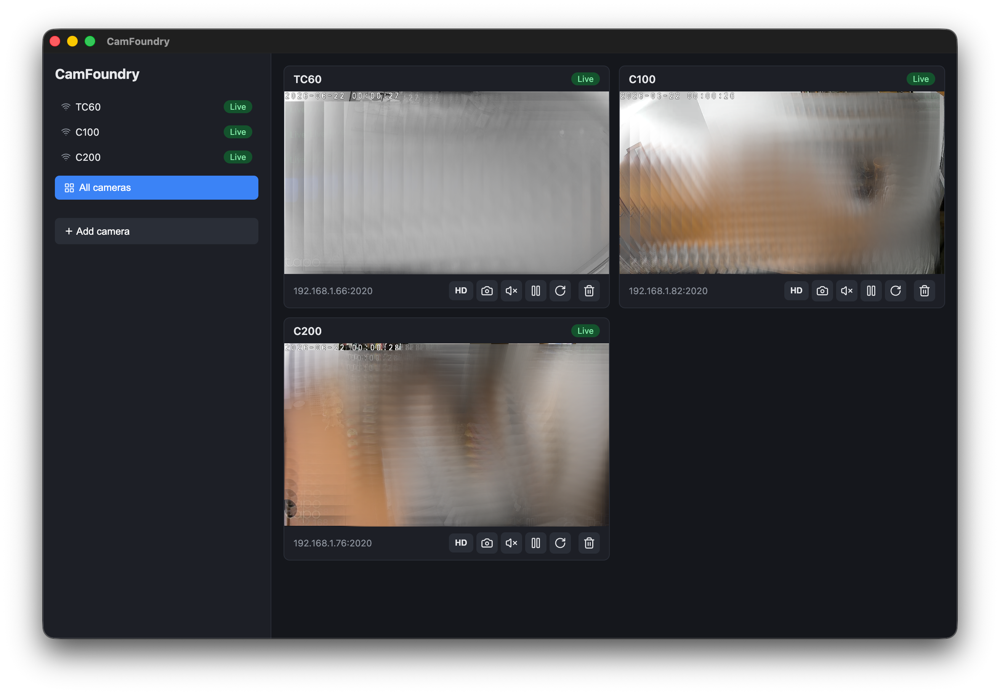
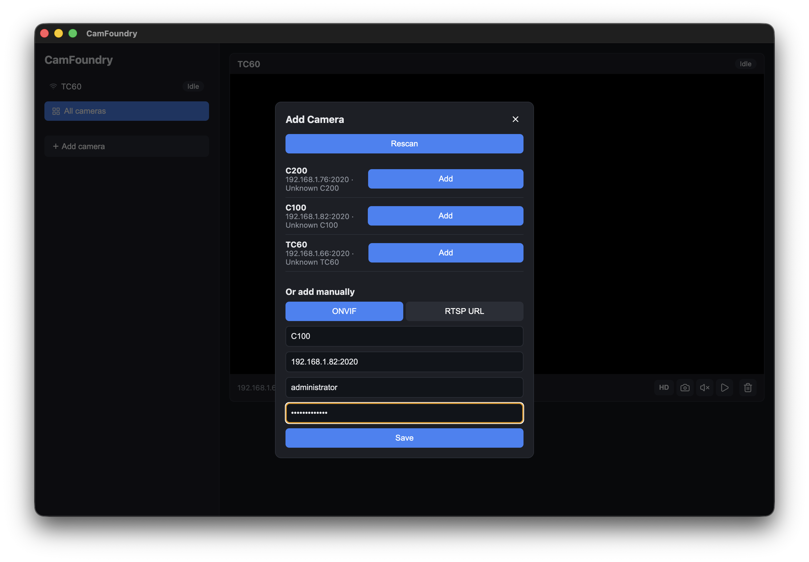
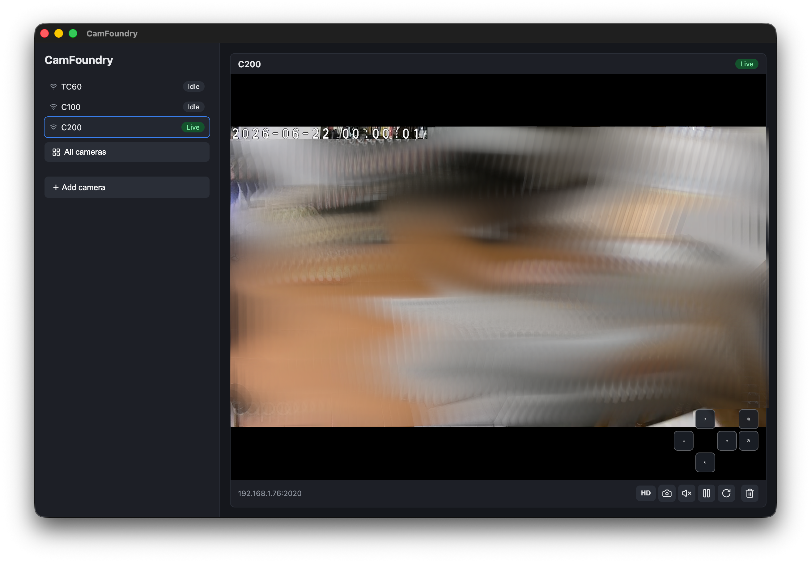

# CamFoundry

Desktop app for viewing local network cameras.

<p align="center">
  
</p>

## Features

- Discover ONVIF cameras on the local network
- Add cameras manually by ONVIF host or RTSP URL
- View live streams (grid or focused view)
- Start, pause, restart, and remove cameras
- Toggle HD/SD when a camera exposes multiple profiles
- Capture snapshots
- Pan, tilt, and zoom on cameras that support PTZ

## Screenshots

| Discover & add | Focused view + PTZ |
| --- | --- |
|  |  |

## Stack

Electron, React, TypeScript, ONVIF, FFmpeg, HLS.js

## Develop

```sh
npm install
npm run dev
npm run typecheck
npm run build
```

Makefile equivalents: `make install`, `make dev`, `make typecheck`, `make build`, `make start`.

## Package

```sh
npm run pack        # unpacked app, current OS
npm run dist        # installer, current OS
npm run dist:mac    # .dmg
npm run dist:win    # NSIS .exe
npm run dist:linux  # AppImage + .deb
```

- Output goes to `dist/`.
- Cross-building Windows/Linux from macOS works for most targets but is most reliable on each native OS.
- Builds are unsigned by default (Gatekeeper/SmartScreen will warn). On macOS, right-click the app and choose Open the first time.
- Signed builds use the standard electron-builder env vars: `CSC_LINK`, `CSC_KEY_PASSWORD` (mac/win); `APPLE_ID`, `APPLE_APP_SPECIFIC_PASSWORD`, `APPLE_TEAM_ID` (notarization).
- Icons live in `resources/`, generated from `icon-source.png`.

## How it works

- ONVIF cameras: the device is asked for an RTSP stream URI. Manual cameras use the given RTSP URL.
- FFmpeg reads the RTSP stream and writes a short local HLS playlist.
- The renderer plays it with HLS.js over a local HTTP server bound to `127.0.0.1`.

## Layout

- `src/main` — Electron main process, IPC, ONVIF, streams, storage
- `src/preload` — bridge exposed to the renderer
- `src/renderer` — React UI
- `src/shared` — shared types

## Support

[Buy me a coffee](https://buymeacoffee.com/appinheiro)
